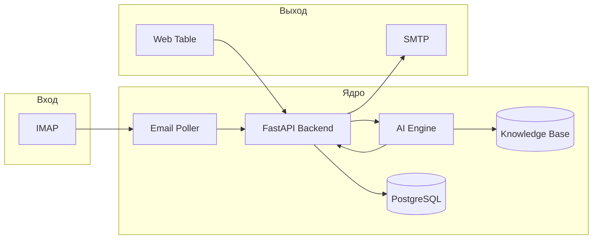

# ENIGMA HACK - AI Support Agent

---

## 1. Пользовательский путь

Как оператор техподдержки взаимодействует с системой - от получения письма до отправки ответа и просмотра таблицы:

| Шаг | Действие                                                                   | Система                                          |
| --- | -------------------------------------------------------------------------- | ------------------------------------------------ |
| 1   | Клиент отправляет письмо на ящик поддержки                                 | -                                                |
| 2   | Система забирает письмо (IMAP)                                             | Email Poller создаёт тикет, AI анализирует текст |
| 3   | AI классифицирует обращение и готовит черновик ответа (RAG по базе знаний) | AI Engine + Knowledge Base                       |
| 4   | Оператор открывает веб-панель и видит таблицу обращений                    | Frontend (веб-таблица)                           |
| 5   | Оператор выбирает тикет, просматривает предложенный ответ                  | GET /tickets/{id}, отображение ответа            |
| 6   | Оператор правит ответ (при необходимости) и нажимает «Отправить»           | PATCH /tickets/{id}, отправка письма (SMTP)      |
| 7   | Письмо уходит клиенту, тикет закрывается                                   | Статус в таблице обновляется                     |

---

## 2. Архитектура системы

Взаимодействие компонентов: почта, AI-агент, база знаний, веб-таблица, отправка ответа.



- **Email Poller**: периодически опрашивает IMAP, создаёт тикеты и передаёт письма в API.
- **FastAPI Backend**: управление тикетами, вызов AI, сохранение в PostgreSQL.
- **AI Engine**: классификация/интент, поиск по базе знаний (RAG), генерация черновика ответа.
- **PostgreSQL**: тикеты, сообщения, пользователи; при необходимости pgvector для RAG.
- **Web Table (React)**: список тикетов, просмотр/редактирование ответа, экспорт (CSV/XLSX).

---

## 3. Риски и минимизация

| Риск                                                   | Митигация                                                                                                                                           |
| ------------------------------------------------------ | --------------------------------------------------------------------------------------------------------------------------------------------------- |
| Нестабильный парсинг писем (вложения, кодировки, HTML) | Использовать проверенную библиотеку (например, `email` + BeautifulSoup для HTML), тесты на реальных срезах писем; fallback - сохранять сырой текст. |
| Галлюцинации или неточности AI                         | Ответ оператору всегда в режиме «черновик»; обязательная проверка перед отправкой; возможность быстрого редактирования в интерфейсе.                |
| Ограниченное время хакатона                            | Заранее подготовить каркас (бэкенд, фронт, БД, Docker), на хакатоне фокус на интеграции AI и одном сценарии «получение → ответ → отправка».         |
| Проблемы с IMAP/SMTP (лимиты, блокировки)              | Использовать тестовый ящик; опция «симуляция» входа писем через API для демо.                                                                       |
| Перегрузка или долгий ответ модели                     | Таймауты на вызовы AI, асинхронная обработка (очередь задач), кэш частых запросов к базе знаний.                                                    |

---

## 4. Запуск проекта

- Убедитесь, что установлены Docker.
- В корне репозитория выполните:
  ```bash
  docker-compose up --build
  ```
- Backend API: http://localhost:8000
- Frontend: http://localhost:3000 (или порт, указанный в `docker-compose.yml`)
- Документация API: http://localhost:8000/docs

Переменные окружения (БД и при необходимости IMAP/SMTP) задаются в `.env` или в `docker-compose.yml`. Пример - `.env.example`.
